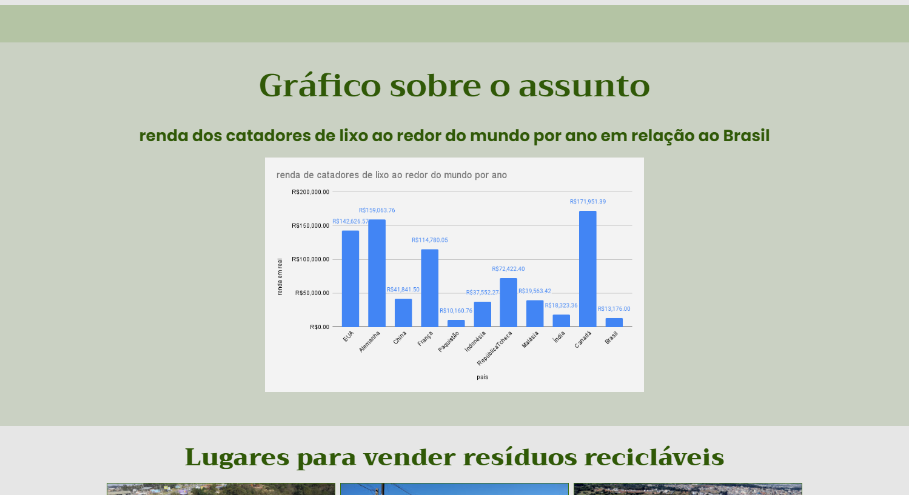

# Sobre
Refiz um site antigo meu. Melhorando a partir de algumas coisas que apreendi. Claro que ainda tem alguns problemas que seria bom melhorar.
## Melhorias
- Semântica
- Design
- Experiência do usário.
## Coisas para fazer
- Deixar o código mais Clean.
- Melhorar animações no scroll.
- Melhorar a performace.
- Trabalhar em telas como TV.
## Acesso
Você pode ver o site [aqui](https://pedro-makoski.github.io/Reciclagem-e-educacao-financeira/#header_top). 
E o site antigo, a qual eu melhorei [aqui](https://pedro-makoski.github.io/Reciclagem-e-educacao-financeira/pages/Reciclagem-e-educa-o-financeira-antiga/index.html), caso queira fazer uma comparação. 
## Algumas fotos da página

